# 🤝 FeitoPorMim - Social Network

## 📱 Descrição
O **FeitoPorMim** é uma rede social Android desenvolvida em **Kotlin** que permite aos utilizadores partilhar momentos, fotos e informações de localização. O aplicativo foi construído com foco em **experiência do utilizador (UX)** e escalabilidade, utilizando tecnologias modernas de nuvem.

O app oferece uma interface moderna e adaptável, permitindo que o utilizador:
- 🔐 Realize **Autenticação** segura (Login e Cadastro);
- 📰 Visualize um **Feed de postagens** em tempo real com **RecyclerView**;
- 📸 Publique novos conteúdos com suporte a **upload de imagens**;
- 📍 Registe postagens com **geolocalização automática**;
- 🔍 **Filtre postagens** por cidade para encontrar conteúdos locais;
- 👤 Gira o seu **Perfil de utilizador**, incluindo troca de foto e senha;
- 🌗 Desfrute de suporte total ao **Modo Escuro (Dark Mode)**;
- 🌎 Alterne entre os idiomas **Português e Inglês** (i18n).

---

## 📸 Visualização (Screenshots)

### ☀️ Modo Claro (Português)
<p align="left">
  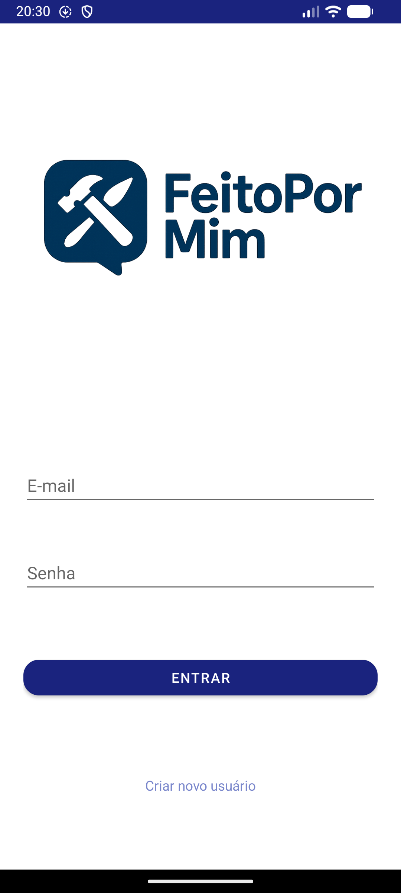
  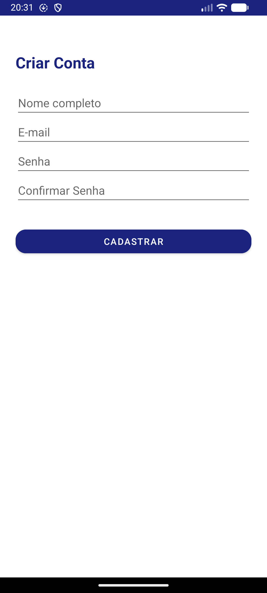
  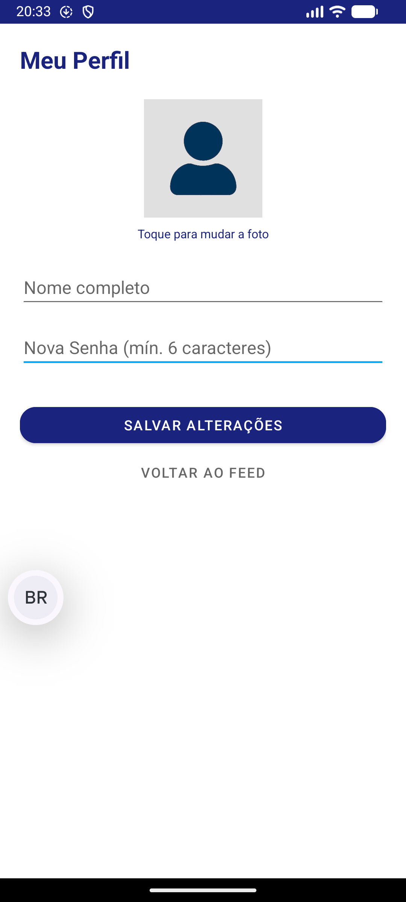
  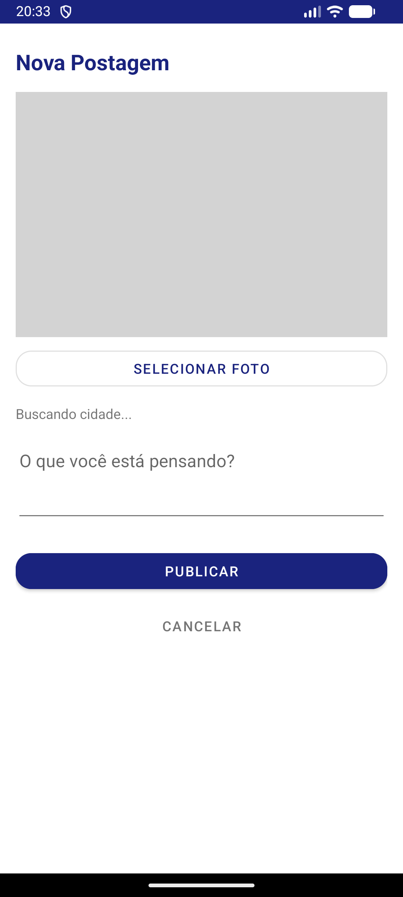
  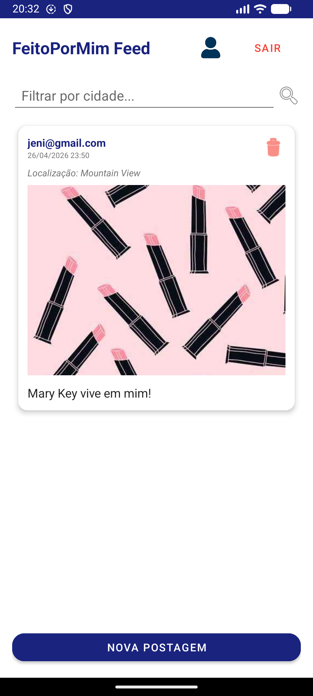
</p>

### 🌙 Modo Escuro (Português)
<p align="left">
  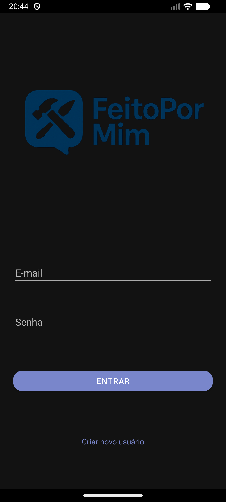
  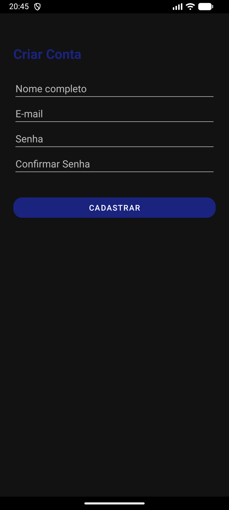
  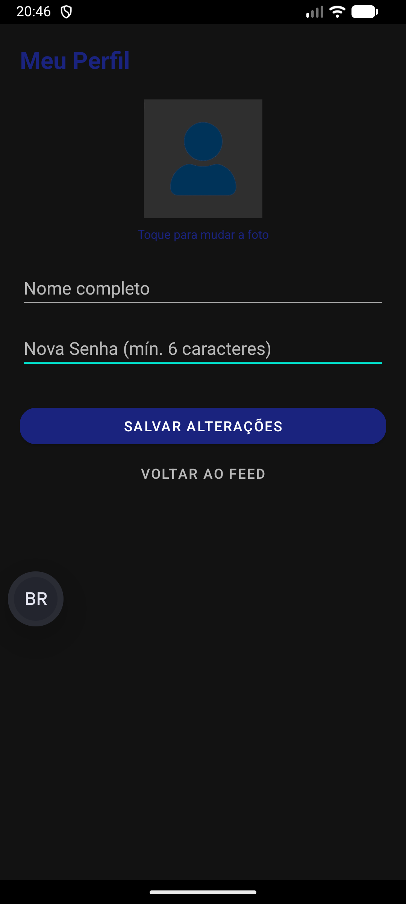
  
  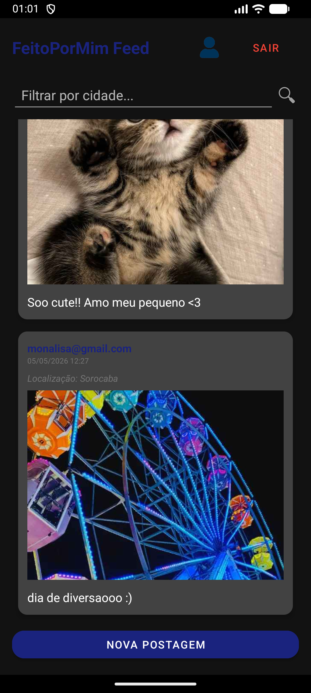
</p>

### English Mode (Light)
<p align="left">
  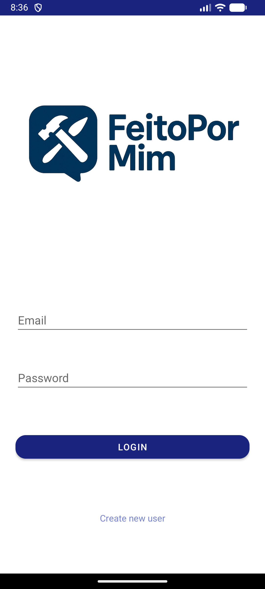
  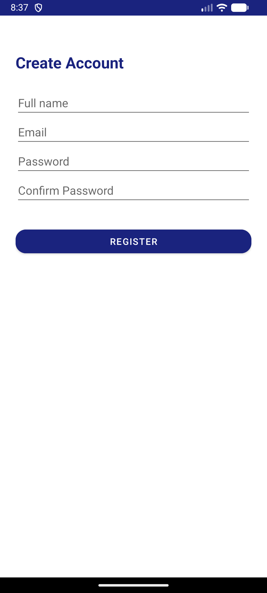
  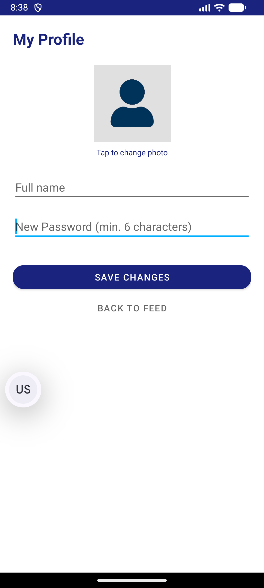
  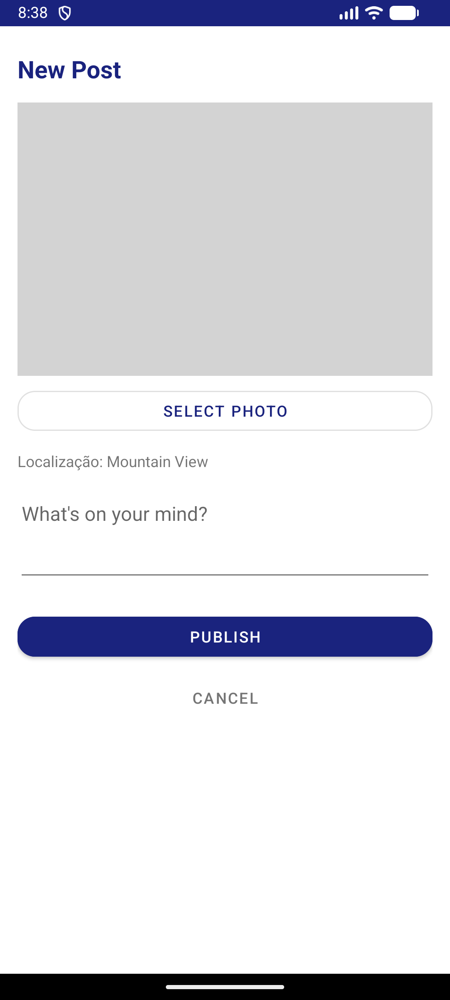
  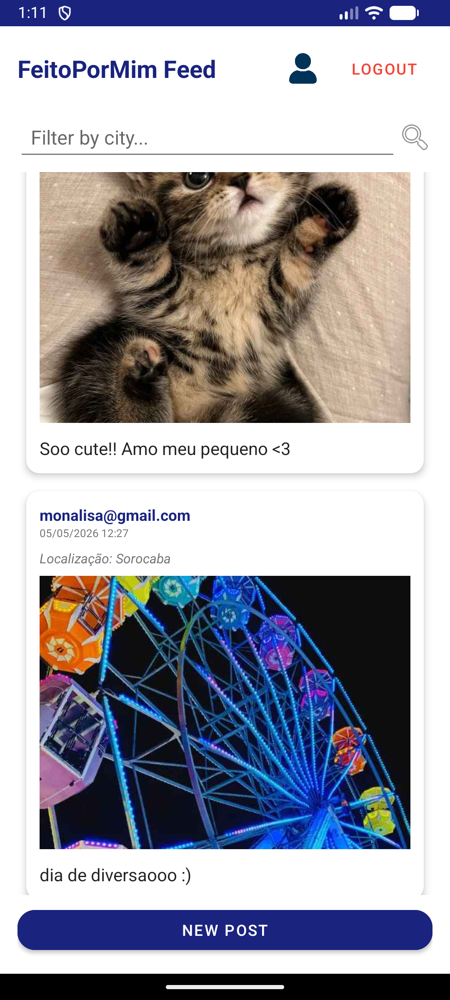
</p>

---

## 🎥 Demonstração em Vídeo
📹 **[Clique Aqui - Demonstração do App](imagens/video_app.webm)**

## 🎬 Apresentação em Vídeo
Assista à demonstração completa do aplicativo, suas funcionalidades e implementação técnica!

➡️ **[ASSISTA AQUI NO YOUTUBE](https://youtu.be/m9xO_1wiHUg?si=YM4PTdB1aIJ8inCm)** ⬅️


---

## 🧩 Funcionalidades Técnicas
- **Integração com Firebase:** Uso de *Cloud Firestore* para dados e *Firebase Storage* para imagens;
- **Arquitetura Android:** Implementação com **ViewBinding** para manipulação segura de layouts;
- **Listagem Dinâmica:** Uso de **RecyclerView** com *Custom Adapters* para o feed;
- **Geolocalização:** Integração com serviços de localização para identificar a cidade do utilizador;
- **Processamento de Imagens:** Conversão e armazenamento eficiente de fotos (Base64/URI);
- **Suporte a Temas:** Implementação de `?android:attr/windowBackground` para compatibilidade total com **DayNight Theme**;
- **Internacionalização (i18n):** Estrutura completa de strings para suporte multilíngue.

---

## 🛠️ Tecnologias Utilizadas
- **Linguagem:** [Kotlin](https://kotlinlang.org/)
- **Backend:** [Firebase](https://firebase.google.com/) (Firestore & Storage)
- **IDE:** Android Studio
- **Interface:** XML + Material Design Components
- **Componentes:** ConstraintLayout, CardView, RecyclerView, Google Play Services (Location)

---

## 🚀 Como executar o projeto
1. Clone este repositório:
   ```bash
   git clone [https://github.com/jeniffer-leme/connect-app.git](https://github.com/jeniffer-leme/connect-app.git)
2. Abra o projeto no Android Studio.
3. Conecte o projeto ao seu console do Firebase.
4. Descarregue o arquivo google-services.json e coloque-o na pasta app/.
5. Execute o app num emulador ou dispositivo físico.

